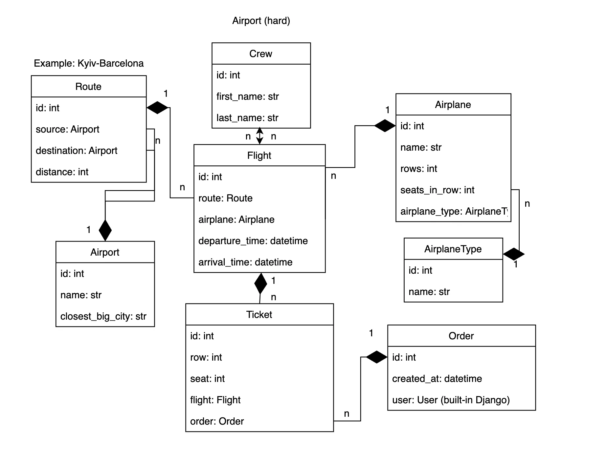
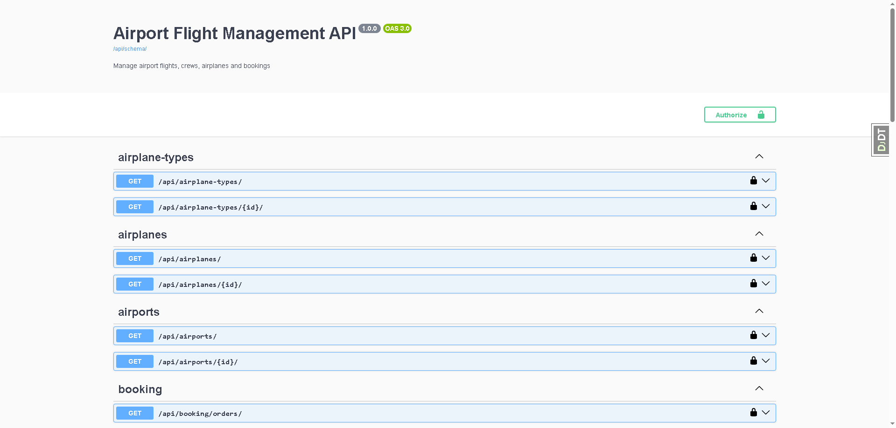
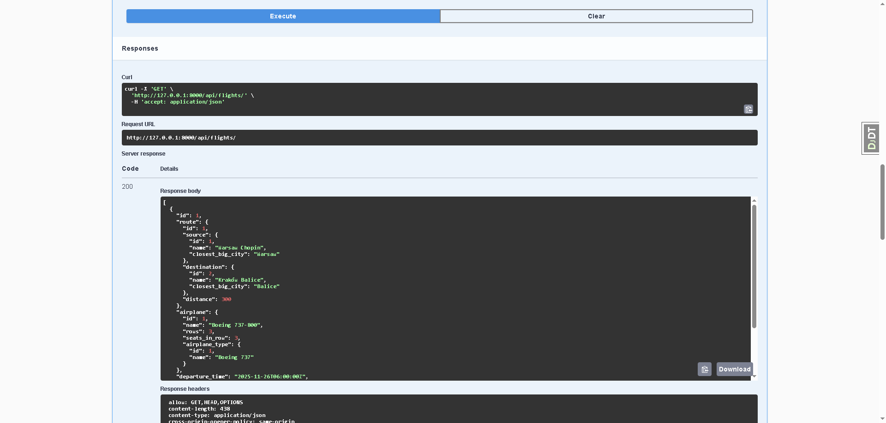
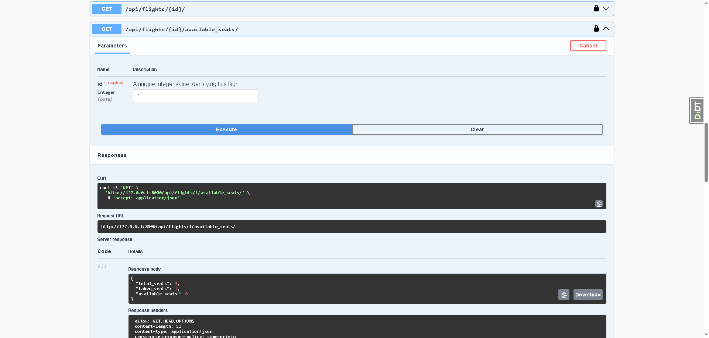

# Airport Flight Management API

REST API for managing airport flights, crews, airplanes and bookings.

## Features

- Manage airports, routes, flights, crews, and airplanes
- Book flight tickets with seat validation
- Check available seats on flights (custom action)
- JWT authentication
- Swagger API documentation

## Installation

### Option 1: Using Docker (Recommended)
```bash
# 1. Clone repository
git clone https://github.com/Grzechu700/airport-flight-management-API.git
cd airport-flight-management-API

# 2. Initialize project
make init
# Update .env.docker with your credentials if needed

# 3. Start containers
make docker-up

# 4. In another terminal, create superuser
docker-compose exec app python manage.py createsuperuser
```

Visit `http://localhost:8000/api/doc/` for API documentation.

**To stop containers:**
```bash
make docker-down
```

---

### Option 2: Local Development
```bash
# 1. Clone repository
git clone https://github.com/Grzechu700/airport-flight-management-API.git
cd airport-flight-management-API

# 2. Initialize project
make init
# Update .env with your database credentials

# 3. Setup virtual environment
python -m venv venv
source venv/Scripts/activate  # Windows Git Bash
make install

# 4. Create PostgreSQL database 'airport_db'

# 5. Run migrations
make migrate
python manage.py createsuperuser

# 6. Run server
make run
```

Visit `http://127.0.0.1:8000/api/doc/` for API documentation.

---

## Usage

- **API Documentation**: http://127.0.0.1:8000/api/doc/ (or http://localhost:8000/api/doc/ for Docker)
- **Admin Panel**: http://127.0.0.1:8000/admin/

## Authentication

Get JWT token:
```bash
POST /api/user/token/
{
  "username": "your_username",
  "password": "your_password"
}
```

Use token in headers:
```
Authorization: Bearer <your_token>
```

## API Endpoints

### Public (Read-only)
- `GET /api/airports/` - List airports
- `GET /api/airplane-types/` - List airplane types
- `GET /api/crews/` - List crew members
- `GET /api/airplanes/` - List airplanes
- `GET /api/routes/` - List routes
- `GET /api/flights/` - List flights
- `GET /api/flights/{id}/available_seats/` - Check available seats

### Authenticated
- `POST /api/booking/orders/` - Create order
- `POST /api/booking/tickets/` - Book ticket

## Database Schema



## Screenshots

### Swagger Documentation


### Flights Endpoint


### Available Seats Endpoint (custom action)


## Running Tests

### Run all tests:
```bash
make test
```

### Run specific test:
```bash
docker-compose run app sh -c "python manage.py test tests.airport.test_models.AirportModelTest"
```

## Available Make Commands
```bash
make help          # Show all available commands
make init          # Initialize project (copy .env.sample to .env)
make install       # Install dependencies
make migrate       # Run database migrations
make test          # Run tests
make run           # Run development server
make docker-up     # Start Docker containers
make docker-down   # Stop Docker containers
make clean         # Remove Python cache files
```

## Technologies

- Django 5.2
- Django REST Framework
- PostgreSQL
- JWT Authentication
- drf-spectacular
- Docker